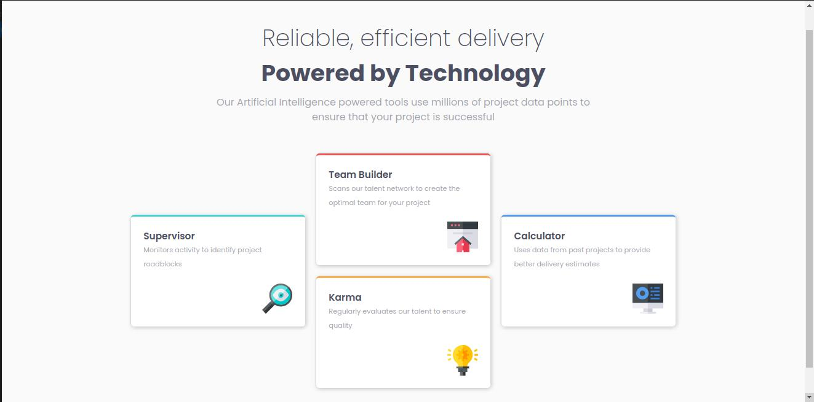

# Frontend Mentor - Four card feature section solution

This is a solution to the [Four card feature section challenge on Frontend Mentor](https://www.frontendmentor.io/challenges/four-card-feature-section-weK1eFYK). Frontend Mentor challenges help you improve your coding skills by building realistic projects.

## Table of contents

- [Overview](#overview)
  - [The challenge](#the-challenge)
  - [Screenshot](#screenshot)
  - [Links](#links)
- [My process](#my-process)
  - [Built with](#built-with)
  - [What I learned](#what-i-learned)
  - [Continued development](#continued-development)
  - [Useful resources](#useful-resources)
- [Author](#author)
- [Acknowledgments](#acknowledgments)

## Overview

### The challenge

Users should be able to:

- View the optimal layout for the site depending on their device's screen size

### Screenshot



### Links

- Solution URL: [https://github.com/ababaug/four-card-feature-section-master]
- Live Site URL: [https://ababaug.github.io/product-preview-card-component-main/]

## My process

### Built with

- Semantic HTML5 markup
- CSS custom properties
- Flexbox
- Mobile-first workflow

**Note: These are just examples. Delete this note and replace the list above with your own choices**

### What I learned

Use this section to recap over some of your major learnings while working through this project. Writing these out and providing code samples of areas you want to highlight is a great way to reinforce your own knowledge.

To see how you can add code snippets, see below:

```html
<!DOCTYPE html>
<html lang="en">
  <head>
    <meta charset="UTF-8" />
    <meta name="viewport" content="width=device-width, initial-scale=1.0" />
    <!-- displays site properly based on user's device -->

    <link
      rel="icon"
      type="image/png"
      sizes="32x32"
      href="./images/favicon-32x32.png"
    />

    <link rel="stylesheet" href="style.css" />

    <title>Frontend Mentor | Four card feature section</title>
  </head>
  <body>
    <div class="container">
      <header class="header">
        <h1 class="dark-color">
          <span class="header-small">Reliable, efficient delivery</span
          ><br />Powered by Technology
        </h1>
        <p class="light-color">
          Our Artificial Intelligence powered tools use millions of project data
          points to ensure that your project is successful
        </p>
      </header>

      <main class="grid-container">
        <div class="box box-1">
          <h2 class="dark-color">Supervisor</h2>
          <p class="light-color">
            Monitors activity to identify project roadblocks
          </p>
          
        </div>

        <div class="box box-2">
          <h2 class="dark-color">Team Builder</h2>
          <p class="light-color">
            Scans our talent network to create the optimal team for your project
          </p>
          
        </div>

        <div class="box box-3">
          <h2 class="dark-color">Karma</h2>
          <p class="light-color">
            Regularly evaluates our talent to ensure quality
          </p>
          
        </div>

        <div class="box box-4">
          <h2 class="dark-color">Calculator</h2>
          <p class="light-color">
            Uses data from past projects to provide better delivery estimates
          </p>
          
        </div>
      </main>
    </div>
  </body>
</html>
```

```css
@import url("https://fonts.googleapis.com/css2?family=Poppins:ital,wght@0,100;0,200;0,300;0,400;0,500;0,600;0,700;0,800;0,900;1,100;1,200;1,300;1,400;1,500;1,600;1,700;1,800;1,900&display=swap");

:root {
  /* PRIMARY COLOR */
  --color-red: hsl(0, 78%, 62%);
  --color-cyan: hsl(180, 62%, 55%);
  --color-orange: hsl(34, 97%, 64%);
  --color-blue: hsl(212, 86%, 64%);

  /* NEUTRAL COLOR */
  --color-very-dark-blue: hsl(234, 12%, 34%);
  --color-grayish-blue: hsl(229, 6%, 66%);
  --color-very-light-gray: hsl(0, 0%, 98%);

  /* FONT FAMILY */
  --poppins-font-family: "Poppins", sans-serif;

  /* FONT WEIGHT */
  --weight-poppins-extralight: 200;
  --weight-poppins-regular: 400;
  --weight-poppins-semibold: 600;

  /* FONT SIZE */
  --font-size: 15px;
}

/* Universal Reset Start*/
*,
*::before,
*::after {
  box-sizing: border-box;
}

* {
  margin: 0;
}

img,
picture,
video,
canvas,
svg {
  display: block;
  max-width: 100%;
}

input,
button,
textarea,
select {
  font: inherit;
}

p,
h1,
h2,
h3,
h4,
h5,
h6 {
  overflow-wrap: break-word;
}

#root,
#__next {
  isolation: isolate;
}
/* Universal Reset */

body {
  line-height: 1.5;
  -webkit-font-smoothing: antialiased;
  font-size: var(--font-size);
  font-family: var(--poppins-font-family);
  background-color: var(--color-very-light-gray);
  display: grid;
  place-content: center;
  min-height: 100vh;
}

.dark-color {
  color: var(--color-very-dark-blue);
}

.light-color {
  color: var(--color-grayish-blue);
}

.container {
  display: grid;
  place-content: center;
  width: 80vw;
  border: 0;
  box-shadow: 10px 10px transparent;
  padding: 6em 3em;
}

.header {
  margin: 0 auto;
  text-align: center;
  font-weight: var(--weight-poppins-semibold);
  font-size: 0.75rem;
  margin-block-end: 4em;
}

.header .header-small {
  font-weight: var(--weight-poppins-extralight);
}

.header p {
  margin-block: 0.5em;
  font-size: 1rem;
  font-weight: var(--weight-poppins-regular);
}

main {
  margin-block-start: 1.5em;
}

.grid-container {
  display: grid;
  grid-template: repeat(2, 1fr) / repeat(auto-fit, minmax(300px, 1fr));
  gap: 1.5em;
}

.box {
  display: grid;
  background-color: #ffffff;
  box-shadow: -1px 0 2px rgba(0, 0, 0, 0.1), 4px 0 8px rgba(0, 0, 0, 0.1),
    0 4px 8px rgba(0, 0, 0, 0.1);
  padding: 2em;
  font-size: 0.8rem;
  border-radius: 0.5em;
}

.box h2 {
  font-weight: var(--weight-poppins-semibold);
}

.box p {
  line-height: 2;
}

.box-1 {
  border-block-start: 4px solid var(--color-cyan);
}

.box-2 {
  border-block-start: 4px solid var(--color-red);
}

.box-3 {
  border-block-start: 4px solid var(--color-orange);
}

.box-4 {
  border-block-start: 4px solid var(--color-blue);
}

img {
  justify-self: end;
  margin-block-start: 2em;
  block-size: 4.875em;
}

@media (min-width: calc(50em + 4px)) {
  .header {
    max-width: 60%;
  }

  .header h1 {
    font-size: 2.4rem;
  }

  .header p {
    font-size: 1rem;
  }

  .grid-container {
    margin: 0 auto;
  }

  .box p {
    font-size: 0.8rem;
  }

  .box-1 {
    grid-row: span 2;
    place-self: center;
  }

  .box-4 {
    grid-area: 1/3/3/4;
    place-self: center;
  }
}
```

## Author

- Website - [https://www.linkedin.com/in/augustine-stephen-abah-51103090/]
- Frontend Mentor - [@ababaug](https://www.frontendmentor.io/profile/ababaug)
